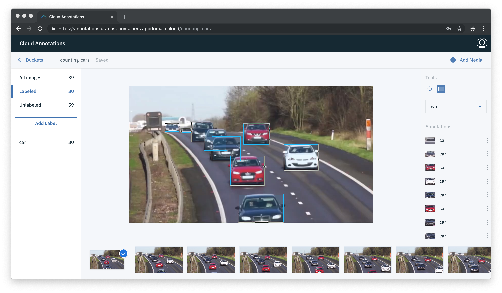

Since we are doing object detection, the data we prepare will consist of images with associated bounding box annotations.

To ease creating annotations in our object storage bucket, we can use the [Cloud Annotations Tool](https://annotations.us-east.containers.appdomain.cloud), a web GUI that sits on top of our object storage that allows us to upload photos and associate them with annotations.

To use the tool just navigate to the [Cloud Annotations Tool](https://annotations.us-east.containers.appdomain.cloud) and add your object storage credentials.

We will be storing our files and annotations in something called a **bucket**, we can create one by clicking **Create bucket**.

## Training data best practices
* The model we will be training is optimized for photographs of objects in the real world. They are unlikely to work well for x-rays, hand drawings, scanned documents, receipts, etc.

* The training data should be as close as possible to the data on which predictions are to be made. For example, if your use case involves blurry and low-resolution images (such as from a security camera), your training data should be composed of blurry, low-resolution images. In general, you should also consider providing multiple angles, resolutions, and backgrounds for your training images.

* The model we will be training can't generally predict labels that humans can't assign. So, if a human can't be trained to assign labels by looking at the image for 1-2 seconds, the model likely can't be trained to do it either.

* We recommend at least 50 training images per label for a usable model, but using 100s or 1000s would provide better results.

* The model we will be training resizes the image to 300x300 pixels, so keep that is mind when training the model with images where one dimension is much longer than the other.

## Labeling the data
To label images:
1. Upload a video or many images
2. Add a label
3. Start drawing bounding boxes

## &nbsp;
> **📁 [Sample Training Data](https://public.boxcloud.com/d/1/b1!N_TtAMQuxseJoI0MXlco14KYfpbX0I_6mDovrNj7HViqvlJAvoQxLrzOvi_Ne6H3aUo4ZT4cm4EDVj-rSnZ5y4hnLtyrS_LacSQyJ-Qui3TDB7skMDMydu4CAfQnYhYSLB9InVREhlOnHefV1OujIRyopj1rnCteIp1pDeUZnGcalIzLuAMB-NKLsqImNEUwYfv1WXP_WrcT6DCRSPrqJhXpiIdsMuN70ixm-dX5aZRZZS7zqYZ1d1MH1hPEdfCGG8PZw2HT4oPUNCgEgYzgbDE8BpQab_UiPXJqqezZpEOgatGcmTTBaYhQuSIwaNVb_vUwI4JOLjqQklus1QW1YE3Mkpv9eUKYd6FkY-h8BMpO-50ELu3ezV9VOW5fDS3Tw75qJupYw2QNHz2wOgg2LW6XTLUx0ZaFEsLl-B3-IAPsj1Bfv_S1OVFu8mrz5dSPqwXRuV0CQd4qQglsRP0jhDXUGyKHCQIY256m0X87_NzLef9IpjC8mrCYSgZmrekowocFrbxj20SCNlKj1lYi3DpPDX87frAXYWbfrgWvNdOwiLIA6uokNX2GtqYkVIypjSpoaDXvI4UL0Oc5_AJCR_64McQEZ4a9wsosDNZIyN0i2mAemIBBnR8Ztti6qVkiNS_UjZeRwqV0pzfKlNf2ZLYkOBXyD1fKracluB3FkiCko9JIUHb1HfGF8iLUNmqSvT9wX9HUhFnTzb3KigtTHiOQAu66z1T64-m6EX_XJKob7jt_z6BkvesgFe9OV0WvIntqsQURjy9BhFh1osParFiSwipdgUGPG5fFNTklk8CUEnrFTYRKLwTW_luejLTvpfpYQqAYVprqeI5pnAdA3X9Y_kz-jSL9gve-X_MjwgzPO5NPI7kBEwfvOAMucWGJy0n7_i_-qStT2QoOdwsNoJjxQ0GESKQVIR5dQxZCXv15sPtXT5BkxEN-WipLp6AYnGIAmNqpMm6sgrwnKL22H6NR52CFHBBZu6gAm5s9JQH2O4TZfcHeW0qsL1bH3YP14O8OO2PZjVApw9A8-CQWODzNgOVQ5YxPopSpSFjCQSYmHQHCOCNAQpRaVxb7kT1w2zUSaC-yNlndJMqCrBa92MNhpAsbQego1g3UHG1818JQkPthS3lXrriRBd8BTspdQ18rM1yUVmObXVX0Mg-hlsm-YneRKUxF6DGPMTxrfaROA0cXZGPe5IVNIQdemdLQpQIbcwV4PRfl3mB67PnCA981eOZlCmU./download)**
